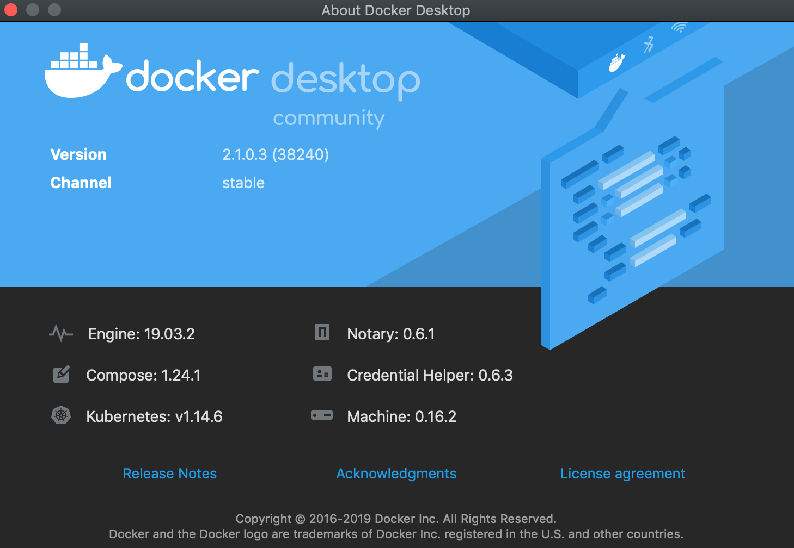
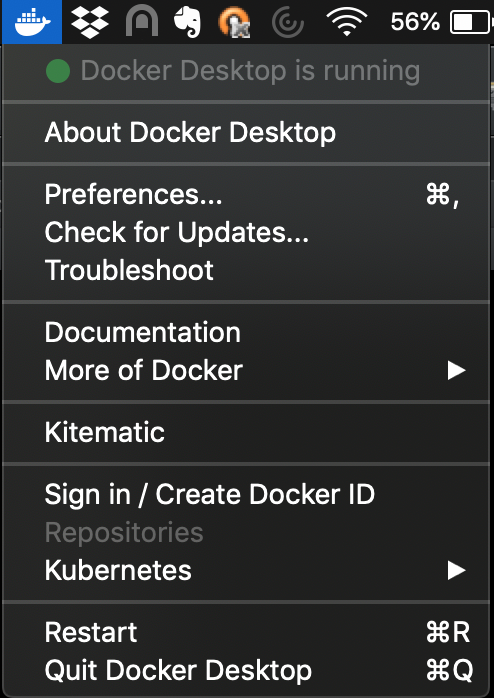
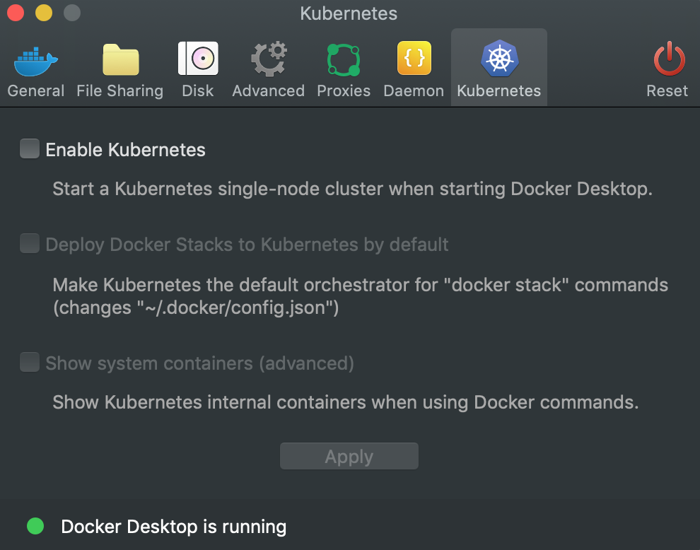
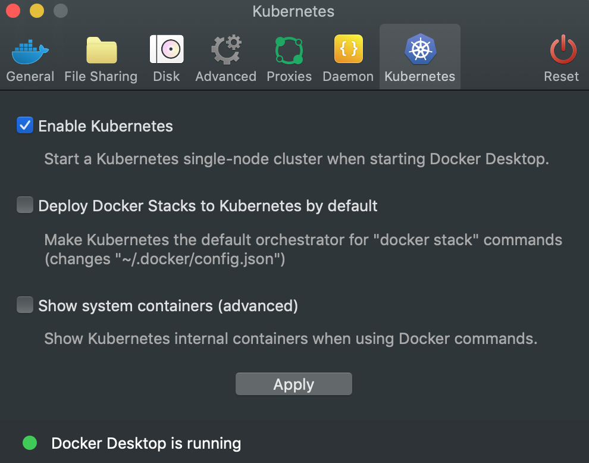
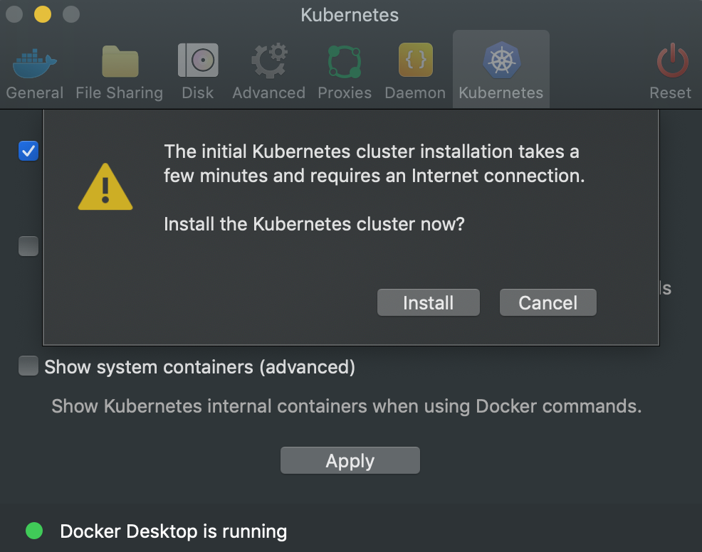
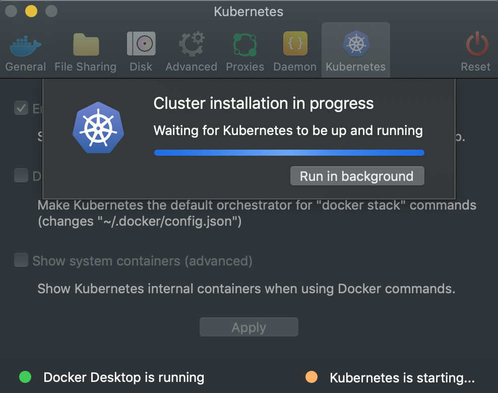
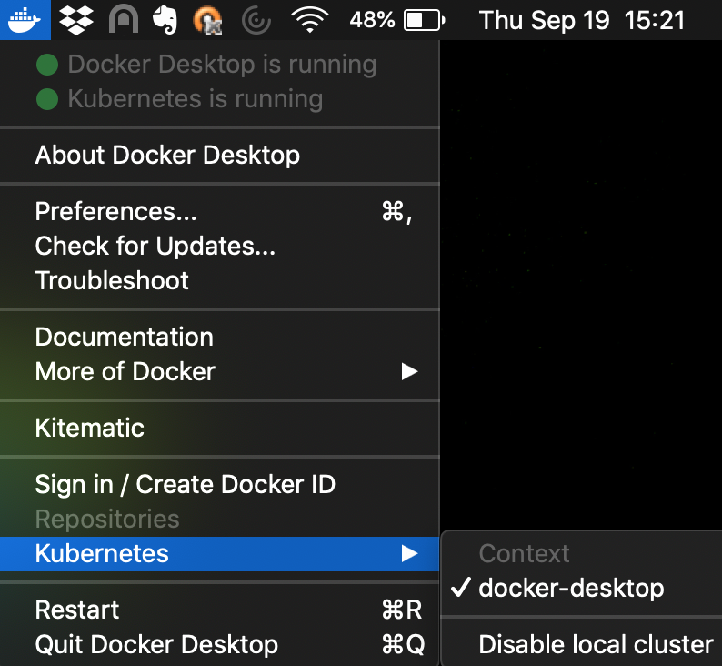

# Setup Kubernetes in Docker Desktop for macos










* Verify that `kubectl` can connect to the Kubernetes "server" running in Docker Desktop:
```
$ kubectl version
Client Version: version.Info{Major:"1", Minor:"14", GitVersion:"v1.14.1", GitCommit:"b7394102d6ef778017f2ca4046abbaa23b88c290", GitTreeState:"clean", BuildDate:"2019-04-19T22:12:47Z", GoVersion:"go1.12.4", Compiler:"gc", Platform:"darwin/amd64"}
Server Version: version.Info{Major:"1", Minor:"14", GitVersion:"v1.14.6", GitCommit:"96fac5cd13a5dc064f7d9f4f23030a6aeface6cc", GitTreeState:"clean", BuildDate:"2019-08-19T11:05:16Z", GoVersion:"go1.12.9", Compiler:"gc", Platform:"linux/amd64"}
```

* Check which context your kubeconfig is currently using/set to:
```
$ kubectl config current-context
docker-desktop
```

* Check all kubeconfig settings:
```
$ kubectl config view
apiVersion: v1
clusters:
- cluster:
    certificate-authority-data: DATA+OMITTED
    server: https://kubernetes.docker.internal:6443
  name: docker-desktop
contexts:
- context:
    cluster: docker-desktop
    user: docker-desktop
  name: docker-desktop
- context:
    cluster: docker-desktop
    user: docker-desktop
  name: docker-for-desktop
current-context: docker-desktop
kind: Config
preferences: {}
users:
- name: docker-desktop
  user:
    client-certificate-data: REDACTED
    client-key-data: REDACTED
```

* Get information on the (single node) Kubernetes cluster running in Docker Desktop:
```
$ kubectl get nodes --output wide
NAME             STATUS   ROLES    AGE   VERSION   INTERNAL-IP    EXTERNAL-IP   OS-IMAGE         KERNEL-VERSION     CONTAINER-RUNTIME
docker-desktop   Ready    master   13m   v1.14.6   192.168.65.3   <none>        Docker Desktop   4.9.184-linuxkit   docker://19.3.2
```

* Get a list of all Pods running in all Kubernetes namespaces:
```
$ kubectl get pods --all-namespaces
NAMESPACE     NAME                                     READY   STATUS    RESTARTS   AGE
docker        compose-6c67d745f6-crqbv                 1/1     Running   0          13m
docker        compose-api-57ff65b8c7-mxccg             1/1     Running   0          13m
kube-system   coredns-584795fc57-8xf49                 1/1     Running   0          14m
kube-system   coredns-584795fc57-rc8lh                 1/1     Running   0          14m
kube-system   etcd-docker-desktop                      1/1     Running   0          13m
kube-system   kube-apiserver-docker-desktop            1/1     Running   0          13m
kube-system   kube-controller-manager-docker-desktop   1/1     Running   0          13m
kube-system   kube-proxy-dsjth                         1/1     Running   0          14m
kube-system   kube-scheduler-docker-desktop            1/1     Running   0          13m
```

## Deploy an app to Kubernetes running on Docker Desktop

* Create a Deployment of an "echo server":
```
$ kubectl run echo-server --image=k8s.gcr.io/echoserver:1.4 --port=8080
deployment.apps/echo-server created
```

* Check status of Deployment:
```
$ kubectl get all --selector='run=echo-server'
NAME                               READY   STATUS    RESTARTS   AGE
pod/echo-server-685b5c54b9-8p2pl   1/1     Running   0          8m45s

NAME                  TYPE       CLUSTER-IP       EXTERNAL-IP   PORT(S)          AGE
service/echo-server   NodePort   10.104.183.233   <none>        8080:30670/TCP   8m9s

NAME                          READY   UP-TO-DATE   AVAILABLE   AGE
deployment.apps/echo-server   1/1     1            1           8m45s

NAME                                     DESIRED   CURRENT   READY   AGE
replicaset.apps/echo-server-685b5c54b9   1         1         1       8m45s
```

* Expose the Deployment by creating a Service (of type `NodePort`):
```
$ kubectl expose deployment echo-server --type=NodePort
service/echo-server exposed
```

* Check on status of our Kubernetes Services:
```
$ kubectl get services

NAME          TYPE        CLUSTER-IP       EXTERNAL-IP   PORT(S)          AGE
echo-server   NodePort    10.104.183.233   <none>        8080:30670/TCP   22s
kubernetes    ClusterIP   10.96.0.1        <none>        443/TCP          62m
```

Note the port assigned to our `echo-server` Service (i.e., port `30670`).

* We should now be able to submit a GET request to our `echo-server`:
```
$ curl localhost:30670
CLIENT VALUES:
client_address=192.168.65.3
command=GET
real path=/
query=nil
request_version=1.1
request_uri=http://localhost:8080/

SERVER VALUES:
server_version=nginx: 1.10.0 - lua: 10001

HEADERS RECEIVED:
accept=*/*
host=localhost:30670
user-agent=curl/7.54.0
BODY:
-no body in request-
```

* Cleanup:
```
$ kubectl delete service echo-server
service "echo-server" deleted

$ kubectl delete deployment echo-server
deployment.extensions "echo-server" deleted
```

Your Kubernetes cluster running inside Docker Desktop for macos has been successfully completed!
