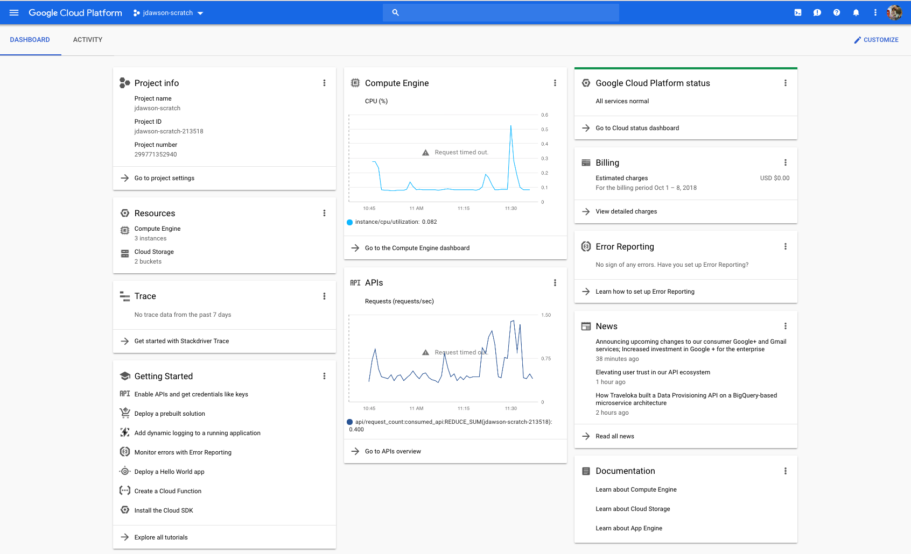
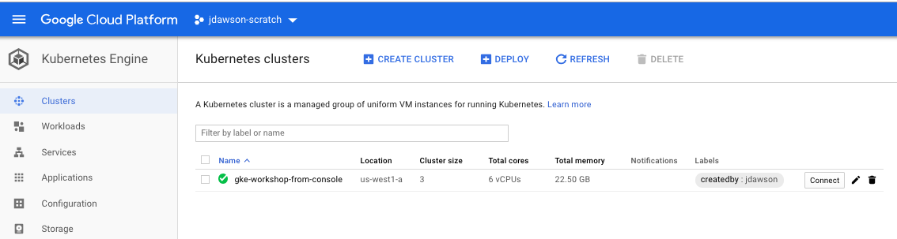
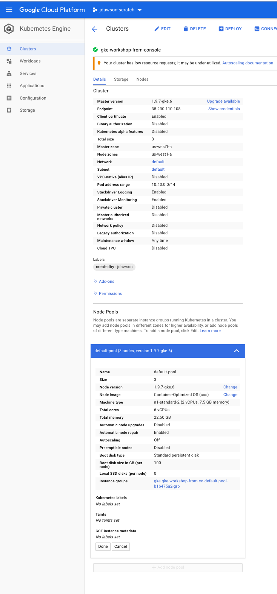
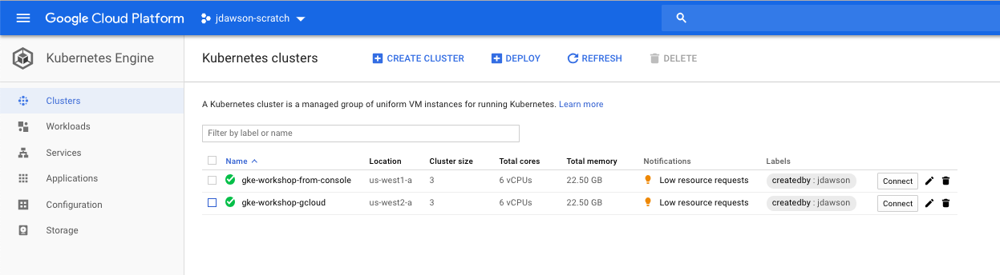

# GKE

Google Provides a managed Kubernetes cluster service 'Kubernetes Engine', that you can utilize to deploy your workloads.

In this section, we will walk through setting up an GKE cluster, which you can use to experiment in the coming sections and demonstrations.

We will use the GCP GKE Console for this section. The equivalent terminal commands will also be displayed for completeness.


## Pre-Reqs

1. You need to have access to an existing GCP account.
2. GCP Project has been created for this workshop.
3. GKE API has been opened up by an Administrator on the project.

## Steps in Console

1. Log into the GCP Console

	
	
2. Navigate to GKE Console

    
    
3. Click on **Create New Cluster**

    
    
4. Fill in the appropriate information in **Create a Kubernetes cluster Form**

    
    
    
    
    
    
    
    
5. `Navigate` back to GKE Dashboard

    
    
6. Click on `Connect`

    
    
7. Click on `Run in Cloud Shell`

    
    
    This opens up a Google Cloud Shell already containing all the bits you need to work with GKE.
    
    
    
8. Navigate to `Clusters` in GKE Console

    
    
    Here you can see our running Kubernetes 3 node cluster which is now ready to deploy workloads.

## Steps in Gcloud Terminal (Optional)

The gcloud terminal also provides a convenient avenue to deploy/configure GKE clusters.  In this _`optional`_  step we will
spin up a similar cluster using he command line.  This apprach is prefrered and easy to automate.

1. Log into the GCP Console

	
	
2. in the upper right corner of console click on the following icon    
 
    
    
    This will open up the gcloud terminal window.
    
3. **Type or Copy** the following in the terminal

    `gcloud container clusters create gke-workshop-gcloud --zone us-west2-a --labels=createdBy=jdawson --machine-type=n1-standard-2`

    The cluster will spin up in after a short delay and display it's running state.

   
## Validate

1. Navigate to Clusters section of GKE Console

    

    In the image below you can view both the GKE clusters you have created. One by way of console and one via gcloud terminal.
    
    
    
    
2. You can also verify your deployment by looking at the Kubernetes system pods. Open up the gcloud console again by selecting the
   following icon
   
    
    
3. **Type of Copy**  the following in the terminal

    `kubectl get pods --all-namespaces`

    You should see output similar to the below image
    
    
    
    Since we haven't deployed any user workloads at this point, the `--all-namespaces` flag includes the system namespace
    where kubernetes stores all of it's objects.
    
## Delete Optional Cluster

1. Navigate to Clusters section of GKE Console

    
    

2. `Select` Checkbox next to **gke-workshop-gcloud** and `Click` trashcan icon.

   

## Enabling SSH

TBD: Jonathan

## Install Latest Version of Docker (Required for Automated Builds in Section 4)
Once you are onto a worker node, run the following commands to upgrade docker to `17.05.*`

You will need to do this on every node, in your cluster.

```
$ sudo vi /etc/apt/preferences.d/docker.pref
# Contents of the above file should look like this:
Package: docker-engine
Pin: version 17.05.*
Pin-Priority: 550

$ sudo apt-get update
$ sudo apt-get install -y docker-engine
```

## Continuing

The next sections wll explain kubectl, and give you a chance to flex some of these actions against your GKE cluster.
