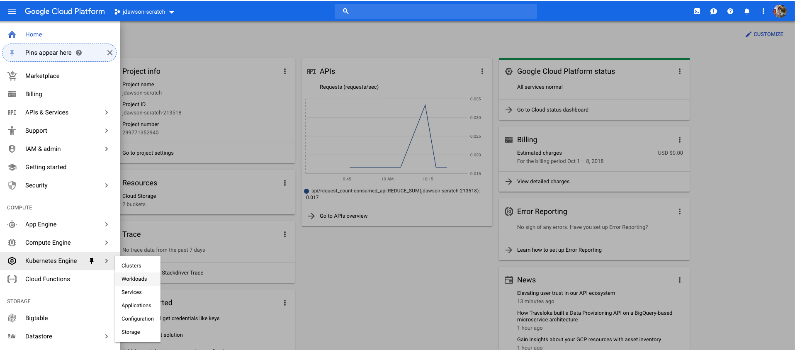
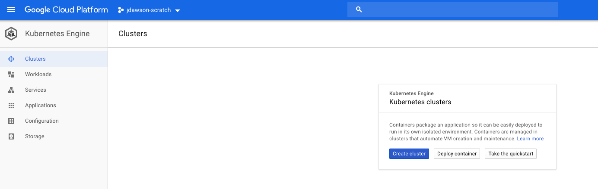
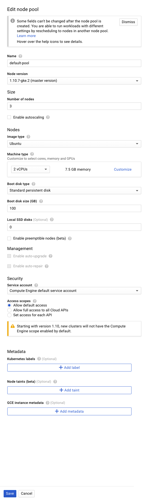
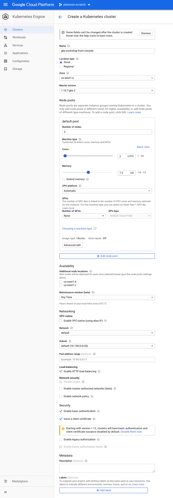
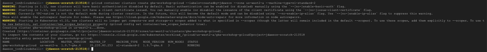
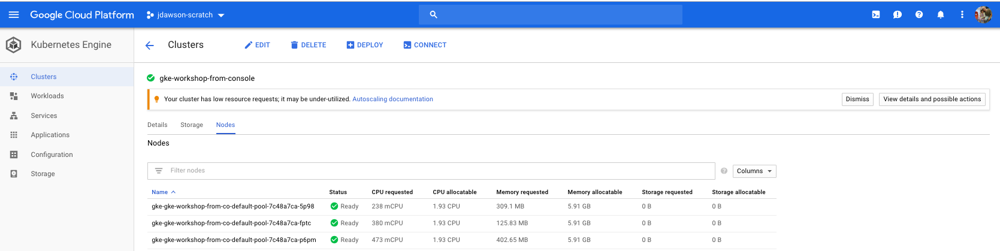
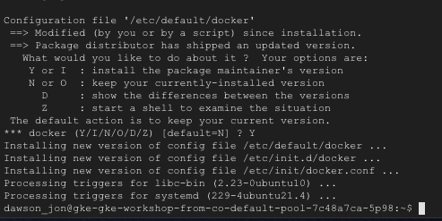

# GKE

Google Provides a managed Kubernetes cluster service 'Kubernetes Engine', that you can utilize to deploy your workloads.

In this section, we will walk through setting up an GKE cluster, which you can use to experiment in the coming sections and demonstrations.

We will use the GCP GKE Console for this section. The equivalent terminal commands will also be displayed for completeness.

## Pre-Reqs

1. You need to have access to an existing GCP account.
2. GCP Project has been created for this workshop.
3. GKE API has been opened up by an Administrator on the project.

## Steps in Console

1. Log into the GCP Dashboard

	
	
2. Navigate to GKE Console

    
    
3. Click on **Create New Cluster**

    
    
4. Fill in the appropriate information in **Create a Kubernetes cluster Form**
    
    Open and edit the node pool configuration.  We are going to use ubuntu for our nodes.  This will allow us to upgrade docker to 
    greater than 17.05 CE and allow us to conduct multi-stage builds later in the workshop.
    
    
    
    Click on **Save**
    
    
    
    Continue to fill in the Create Cluster Form and click on **Create**
    
5. Navigate to **Clusters** in GKE Console

    
    
    Here you can see our running Kubernetes 3 node cluster which is now ready to deploy workloads.

## Steps in Gcloud Terminal (Optional)

The gcloud terminal also provides a convenient avenue to deploy/configure GKE clusters.  In this _`optional`_  step we will
spin up a similar cluster using he command line.  This apprach is prefrered and easy to automate.

1. Log into the GCP Dashboard

    
	
2. in the upper right corner of console click on the following icon    
 
    
    
    This will open up the gcloud terminal window.
    
3. **Type or Copy** the following in the terminal

    `gcloud container clusters create gke-workshop-gcloud --zone us-west2-a --labels=createdBy=jdawson --machine-type=n1-standard-2`

    The cluster will spin up in after a short delay and display it's running state.
    
    

   
## Validate

1. Navigate to Clusters section of GKE Console

    

    In the image below you can view both the GKE clusters you have created. One by way of console and one via gcloud terminal.
    
    
    
    
2. You can also verify your deployment by looking at the Kubernetes system pods. Open up the gcloud console again by selecting the
   following icon
   
    
    
3. **Type of Copy**  the following in the terminal

    `kubectl get pods --all-namespaces`

    You should see output similar to the below image
    
    
    
    Since we haven't deployed any user workloads at this point, the `--all-namespaces` flag includes the system namespace
    where kubernetes stores all of it's objects.
    
## Delete Optional Cluster

1. Navigate to Clusters section of GKE Console

   
    

2. `Select` Checkbox next to **gke-workshop-gcloud** and `Click` trashcan icon.

   
   
   
## Upgrade Cluster

TBD: Jonathan

## Install Latest Version of Docker (Required for Automated Builds in Section 4)

1. Navigate to the node details section of the Cluster console

    
    
    From here you can see the name of your node(s).

2. **On each node** in the cluster we are going to update docker to the latest version to help with further workshop topics.
   GKE uses Ubuntu 16.04 for node boxes so we will follow the instructions from the docker site here.
   
   **FOR EACH** node in cluster
   	
   In the upper right corner of console click on the following icon    
    
   
       
    This will open up the gcloud terminal window.  SSH into your node via the gcloud compute ssh command. **Note**: your
    node id(s) will be different.
    
   ` gcloud compute ssh gke-gke-workshop-from-co-default-pool-7c48a7ca-5p98 --zone us-west1-a`
    
    Once connected run the following commands ...
    
    `sudo apt-get update`
    
    `sudo apt-get install -y apt-transport-https ca-certificates curl software-properties-common`
   
   ` curl -fsSL https://download.docker.com/linux/ubuntu/gpg | sudo apt-key add -`
   
   ` sudo add-apt-repository "deb [arch=amd64] https://download.docker.com/linux/ubuntu $(lsb_release -cs) stable"`
   
    `sudo apt-get update`
    
    `sudo apt-get install -y docker-ce`
    
    The above command will install the latest stable version of docker CE.  Please refer to the below image as you will
    asked to swap default docker ... choose "Y".
    
    
    
   Verify the new docker version by entering the following command ...
   
   `docker -v `
   
   Your docker version should be > 17.05 CE to be able to support multi-stage build presented in next section.
   
   e.g. `Docker version 18.06.1-ce, build e68fc7a`
    

## Continuing

The next sections wll explain kubectl, and give you a chance to flex some of these actions against your GKE cluster.
